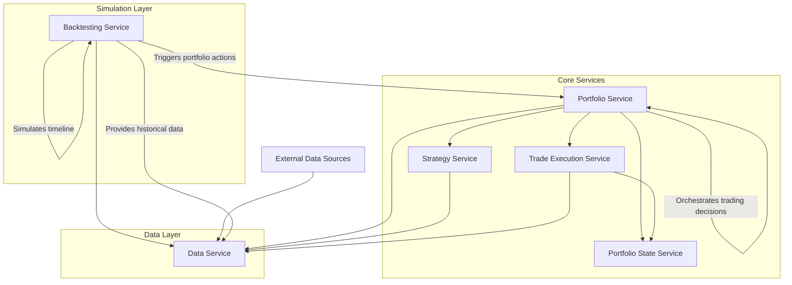

# Python Algorithmic Trading System (WIP)

[](https://codecov.io/gh/denim-bluu/py_momentum)

## Overview of the System

This project is a Python-based algorithmic trading system designed to facilitate the development, backtesting, and execution of trading strategies. The system is modular and extensible, allowing for easy integration of new strategies and data sources.

## Project Structure

The system consists of the following core services:

1. Data Service ✅:
   - Fetch and store historical and real-time market data
   - Provide data to other services via API
   - Calculate and store common technical indicators
   - Manage data caching for improved performance

2. Strategy Service ✅:
   - Implement and manage multiple trading strategies
   - Generate trading signals based on market data and configured strategies
   - Provide risk calculations for potential trades
   - Allow dynamic configuration of strategy parameters

3. Portfolio Service ✅:
   - Act as the central orchestrator for the trading system
   - Receive signals from the Strategy Service
   - Determine desired portfolio state based on signals and current market conditions
   - Implement rebalancing logic and scheduling
   - Generate trade orders to align actual portfolio with desired state
   - Implement portfolio-level risk management rules
   - Manage cash allocations within the portfolio
   - Provide APIs for querying desired portfolio state and manually triggering rebalances

4. Trade Execution Service ✅:
   - Receive and execute trade orders from the Portfolio Service
   - Interact with broker APIs or simulate trades in backtest mode
   - Track status of submitted orders (pending, filled, partially filled, cancelled)
   - Provide real-time updates on order status
   - Implement smart order routing and execution algorithms
   - Handle order types relevant to the trading strategies (e.g., market, limit orders)

5. Portfolio State Service ✅:
   - Maintain the actual, settled portfolio state
   - Reconcile desired state (from Portfolio Service) with executed trades (from Trade Execution Service)
   - Track actual positions, cash balance, and transaction history
   - Calculate and store portfolio performance metrics
   - Handle corporate actions (e.g., dividends, splits)
   - Provide APIs for querying current portfolio state and historical performance

6. Backtesting Service 🚧:
   - Coordinate with other services to simulate historical trading
   - Simulate the passage of time and provide historical context
   - Trigger the Portfolio Service to make decisions based on the simulated timeline
   - Fetch historical data from Data Service
   - Collect performance metrics and generate reports
   - Provide tools for strategy optimization and parameter tuning

## System Architecture

The system follows a modular architecture with clear separation of concerns:



## Configuration

Configuration settings for the application are managed using the `Config` class.

## Installation

To install the required dependencies, run:

```sh
pdm install
```

## Running the Application

Before start the application, you need to initiate the PostgreSQL database and Redis server via Docker:

```sh
docker-compose up -d
# (If you want to tear down the services, use `docker-compose down`)
```

To start the application, execute:

```sh
python main.py
```

## Example Requests

### Data Service

1. Fetch Historical Data

   ```sh
   curl -X GET "http://localhost:8000/api/v1/data/stock/AAPL?start_date=2023-01-02&end_date=2023-04-09&interval=1d"
   ```

2. Batch Fetch Historical Data

   ```sh
   curl -X POST http://localhost:8000/api/v1/data/batch \
   -H "Content-Type: application/json" \
   -d '{
   "symbols": ["AAPL", "GOOGL", "MSFT"],
   "start_date": "2023-01-01",
   "end_date": "2023-12-30",
   "interval": "1d"
   }'
   ```

### Strategy Service

1. Get Strategy Parameters

   ```sh
   curl -X GET http://localhost:8000/api/v1/strategy/strategy_parameters
   ```

2. Configure Strategy Parameters (Not fully implemented)

   ```sh
   curl -X POST http://localhost:8000/api/v1/strategy/configure_strategy \
   -H "Content-Type: application/json" \
   -d '{
   "lookback_period": 120,
   "top_percentage": 0.3
   }'
   ```

3. Generate signals

   ```sh
   curl --location http://localhost:8000/api/v1/strategy/generate_signals \
   --header 'Content-Type: application/json' \
   --data '{
   "symbols": ["AAPL", "GOOGL", "MSFT"],
   "start_date": "2023-01-01",
   "end_date": "2023-12-31",
   "interval": "1d",
   "market_index": "^GSPC"
   }'

   ```

### Portfolio State Service

1. Initiate Portfolio

   ```sh
   curl --location --request POST 'http://localhost:8000/api/v1/portfolio_state/initiate_portfolio_state' --header 'Content-Type: application/json' --data-raw '{"initial_cash_balance": 1000000}'
   ```

2. Get the latest portfolio state

   ```sh
   curl --location --request GET 'http://localhost:8000/api/v1/portfolio_state/get_latest_portfolio_state' --header 'Content-Type: application/json'
   ```

3. Get the portfolio state on a specific date

   ```sh
   curl --location --request GET 'http://localhost:8000/api/v1/portfolio_state/get_portfolio_state' --header 'Content-Type: application/json' --data '{"date": "2023-08-01"}'
   ```

4. Update the portfolio state

   ```sh
   curl --location --request PUT 'http://localhost:8000/api/v1/portfolio_state/update_portfolio_state' --header 'Content-Type: application/json' --data-raw '{"cash_balance": 1000000, "positions": [{"symbol": "AAPL", "quantity": 100, "price": 150.0, "value": 15000.0}], "total_value": 1015000.0}'
   ```

### Portfolio Service

1. Rebalance Portfolio

   ```sh
   curl -X POST http://localhost:8000/api/v1/portfolio/rebalance --header "Content-Type: application/json" \
   -d '{
      "date": "2023-06-01",
      "symbols": ["AAPL", "GOOGL", "MSFT"],
      "interval": "1d",
      "market_index": "^GSPC"
   }'

   ```

2. Portfolio Summary

   ```sh
   curl -X GET http://localhost:8000/api/v1/portfolio/summary/2023-06-01
   ```

## Testing

To run the tests, use:

```sh
pytest
```

## Dependencies

The project relies on several key dependencies, including but not limited to:

- `yfinance`
- `pandas`
- `fastapi`
- `sqlalchemy`
- `pytest`

For a complete list of dependencies, refer to the [pyproject.toml](pyproject.toml) and [pdm.lock](pdm.lock) files.

## Authors

- Joon Kang - [denim.bluu@gmail.com](mailto:denim.bluu@gmail.com)
